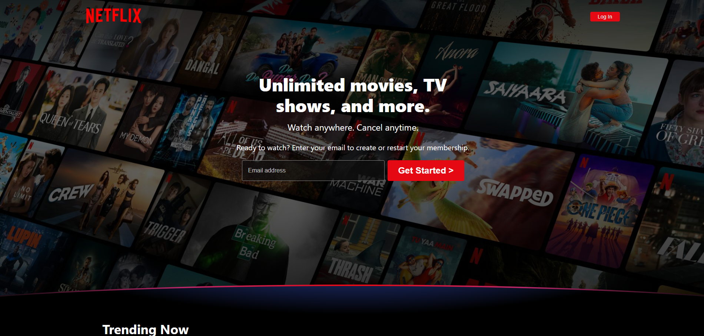
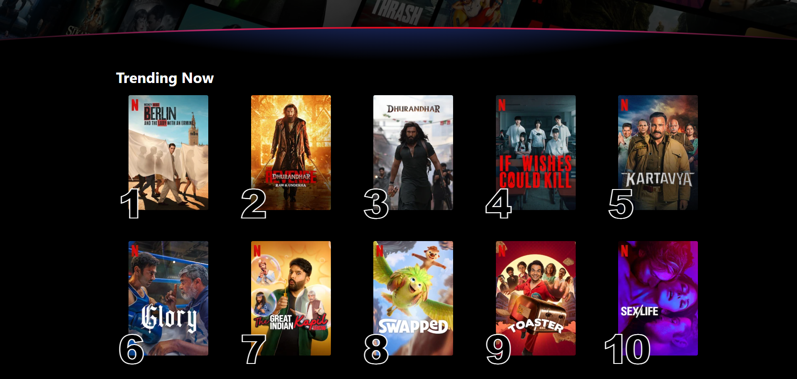

# Netflix Landing Page Clone

An open-source frontend engineering project mapping the complete, pixel-perfect visual interface of the official Netflix landing page from scratch. Built entirely using raw semantic structural blocks and fully responsive layouts.

## 🚀 Experience the Project

Explore the dynamic behavior, layout adaptations, and interactive segments of this project directly on your screen:

---

## 🛠️ Built With

* **Semantic HTML5** — Accessible document structures dividing headers, contextual grids, and layout components.
* **Responsive CSS3** — Fluid element scaling matching all mobile viewport sizes, featuring stylized outline typographic overlays.
* **Vanilla JavaScript** — Fast DOM actions powering smooth expandable navigation panels and dynamic toggle menus.

---

## 📸 Interface Preview Gallery

### Core Hero Entry & User Portal

### Content Display Grid Elements
| Feature Adaptations | Smart Offline Management |
| :---: | :---: |
||  |

### Device Profiles & Curation Lists
| Universal Ecosystem Reach | Tailored Profile Directories |
| :---: | :---: |
|  |  |

### Interactive Expandable Panels & Footers
| Interactive FAQ Toggle States | Complete Global Navigation Directory |
| :---: | :---: |
|  |  |

### Interactive Expandable Panels & Footers
| INNER PROFILE PAGE

